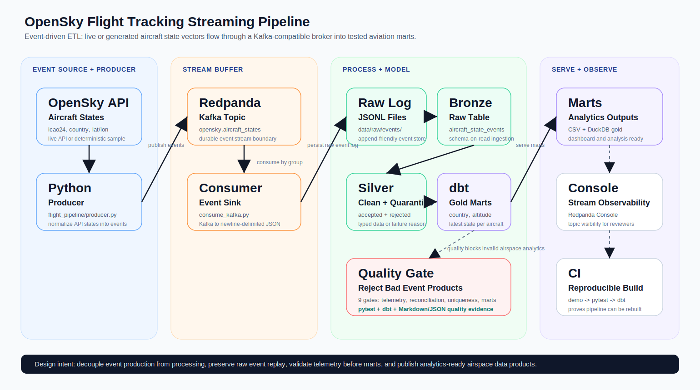

# OpenSky Flight Tracking Streaming Pipeline

Event-driven data engineering project that ingests aircraft position events,
streams them through a Kafka-compatible architecture, validates telemetry and
publishes curated aviation analytics marts.

This repository is written as a portfolio-grade streaming case study. It does
not stop at "how to run the code"; it documents the event flow, ETL boundaries,
data contracts, quality gates, transformation layers and operational reasoning
behind the pipeline.



## Executive Summary

OpenSky aircraft state vectors are high-frequency operational events. Raw state
messages are noisy and not directly useful for analytics. A data engineering
pipeline needs to decouple event production from processing, preserve raw
events, clean and validate telemetry, then publish trustworthy data products.

This project implements that pattern with:

| Capability | Implementation |
|---|---|
| Event ingestion | Python producer for live OpenSky API or deterministic sample events |
| Streaming buffer | Redpanda/Kafka topic `opensky.aircraft_states` |
| Raw event store | Newline-delimited JSON files in `data/raw/events/` |
| Warehouse engine | DuckDB bronze, silver and gold schemas |
| Transformations | SQL and dbt-style models |
| Data quality | Python quality gates, dbt tests, pytest and markdown report |
| Observability | Redpanda Console and GitHub Actions CI |

OpenSky API documentation: https://openskynetwork.github.io/opensky-api/

## Business Questions

The curated marts support aviation monitoring and airspace analytics:

- How many aircraft are active by origin country?
- Which altitude bands dominate current traffic?
- What is the latest known state of each aircraft?
- Are event coordinates, speed and altitude values valid?
- Is the pipeline reproducible without relying on live API availability?

## Streaming ETL Design

This project combines streaming ingestion with micro-batch transformation:

1. Extract aircraft states from OpenSky API or deterministic sample generator.
2. Publish normalized events to Kafka/Redpanda or write directly to JSONL for local demo.
3. Load event logs into DuckDB bronze tables.
4. Transform raw events into typed silver positions.
5. Build gold marts for country airspace, altitude distribution and latest state.
6. Validate the resulting data products before consumption.

## Event Flow

```text
OpenSky API / sample generator
  -> flight_pipeline.producer
  -> Redpanda topic: opensky.aircraft_states
  -> flight_pipeline.consume_kafka
  -> data/raw/events/*.jsonl
  -> bronze.aircraft_state_events
  -> silver.aircraft_positions_clean
  -> gold.mart_country_airspace
  -> gold.mart_altitude_distribution
  -> gold.mart_aircraft_latest_state
```

## Extract

`flight_pipeline/producer.py` supports two modes:

| Mode | Purpose |
|---|---|
| `sample` | Deterministic events for repeatable tests and CI |
| `live` | Calls the public OpenSky API for current aircraft states |

The producer normalizes source fields into a stable event contract:

| Field | Meaning |
|---|---|
| `observed_at` | Timestamp when the state was observed |
| `icao24` | Aircraft identifier |
| `callsign` | Flight callsign when available |
| `origin_country` | Country assigned by OpenSky |
| `longitude`, `latitude` | Aircraft position |
| `baro_altitude` | Barometric altitude in meters |
| `velocity` | Aircraft velocity |
| `true_track` | Track angle |
| `vertical_rate` | Rate of climb/descent |
| `on_ground` | Whether aircraft is on ground |

## Stream Buffer

The optional streaming path uses Redpanda as a Kafka-compatible broker:

```text
topic: opensky.aircraft_states
key:   icao24
value: aircraft state event JSON
```

Why this matters:

- producers and consumers are decoupled,
- events can be replayed by consumer group,
- reviewers can inspect traffic in Redpanda Console,
- the architecture mirrors production event-driven pipelines.

## Load

The consumer persists events to an append-friendly raw log:

```text
data/raw/events/opensky_events_from_kafka.jsonl
```

For CI and easy local review, the project can skip Kafka and write sample events
directly to:

```text
data/raw/events/opensky_events.jsonl
```

DuckDB loads those events into:

```sql
bronze.aircraft_state_events
```

## Transform

`flight_pipeline/build_marts.py` builds three warehouse layers:

| Layer | Object | Grain | Purpose |
|---|---|---|---|
| Bronze | `bronze.aircraft_state_events` | raw event | Preserve event payloads for replay/debugging |
| Silver | `silver.aircraft_positions_clean` | one valid aircraft position event | Typed and validated telemetry |
| Gold | `gold.mart_country_airspace` | country | Aircraft count, event count, average speed and altitude |
| Gold | `gold.mart_altitude_distribution` | altitude band | Ground, low, medium and cruise traffic distribution |
| Gold | `gold.mart_aircraft_latest_state` | aircraft | Latest known event per `icao24` |

Silver transformations include:

| Transformation | Purpose |
|---|---|
| lowercase and trim `icao24` | Stable aircraft identifier |
| cast timestamps to `TIMESTAMPTZ` | Time-aware analytics |
| convert velocity to `speed_kmh` | Human-readable speed metric |
| validate latitude and longitude | Prevent invalid geospatial outputs |
| derive `altitude_band` | Operational segmentation |
| latest-state window function | One row per current aircraft state |

## dbt Model Design

The dbt project mirrors the event product layers:

```text
dbt/models/staging/stg_aircraft_positions.sql
dbt/models/intermediate/int_aircraft_latest_state.sql
dbt/models/marts/mart_country_airspace.sql
dbt/models/marts/mart_altitude_distribution.sql
```

| dbt Model | Role |
|---|---|
| `stg_aircraft_positions` | Stable interface over clean silver events |
| `int_aircraft_latest_state` | Deduplicates to latest state per aircraft |
| `mart_country_airspace` | Country-level airspace activity metrics |
| `mart_altitude_distribution` | Traffic distribution by altitude band |

## Data Quality Strategy

The pipeline treats telemetry quality as a first-class concern. Invalid events
should not silently reach marts.

| Check | Failure Meaning |
|---|---|
| `silver_has_events` | No events reached the curated layer |
| `icao24_present` | Aircraft identity is missing |
| `valid_coordinates` | Position cannot be mapped |
| `valid_speed` | Velocity is impossible for expected aircraft states |
| `valid_altitude` | Altitude is outside expected operational range |

Quality is enforced through:

| Layer | Tool | Evidence |
|---|---|---|
| Pipeline | `flight_pipeline/data_quality.py` | `reports/data_quality_report.md` |
| Models | dbt tests | not-null and uniqueness checks |
| Repository | pytest | demo rebuilds expected marts |
| CI | GitHub Actions | clean checkout passes demo, pytest and dbt |

## Operational Design

| Concern | Design Choice |
|---|---|
| API rate limits | Deterministic sample mode keeps CI reliable |
| Broker availability | JSONL demo path allows local run without Kafka |
| Event replay | Raw event log and Kafka consumer group support replay pattern |
| Data contracts | `docs/data_contract.md` defines required fields and rules |
| Observability | Redpanda Console exposes topics and event flow |
| Reproducibility | GitHub Actions rebuilds the project on every push |

## Failure Modes Handled

| Failure Mode | Handling |
|---|---|
| API unavailable | sample mode keeps tests reproducible |
| Kafka unavailable | JSONL sink still demonstrates processing path |
| Invalid coordinates | quality gate fails |
| Missing aircraft ID | quality gate and dbt tests fail |
| Bad speed or altitude | quality gate fails |
| Duplicate latest state | dbt uniqueness test fails |

## Repository Structure

```text
.
|-- .github/workflows/ci.yml
|-- dbt/
|   |-- dbt_project.yml
|   |-- profiles.yml
|   `-- models/
|       |-- staging/
|       |-- intermediate/
|       `-- marts/
|-- docs/
|   |-- architecture-etl.svg
|   `-- data_contract.md
|-- flight_pipeline/
|   |-- producer.py
|   |-- consume_kafka.py
|   |-- build_marts.py
|   |-- data_quality.py
|   `-- sample_events.py
|-- scripts/run_demo.py
|-- tests/test_stream_pipeline.py
|-- docker-compose.yml
|-- requirements.txt
`-- requirements-kafka.txt
```

## How To Run

Install dependencies:

```powershell
python -m venv .venv
.\.venv\Scripts\Activate.ps1
pip install -r requirements.txt
```

Run deterministic local demo:

```powershell
python scripts\run_demo.py --rows 250
```

Run with live OpenSky API:

```powershell
python -m flight_pipeline.producer --mode live --sink jsonl
python -m flight_pipeline.build_marts
python -m flight_pipeline.data_quality
```

Run with Redpanda/Kafka:

```powershell
docker compose up -d
pip install -r requirements-kafka.txt
python -m flight_pipeline.producer --mode sample --sink kafka --rows 500
python -m flight_pipeline.consume_kafka --max-messages 500
python -m flight_pipeline.build_marts
python -m flight_pipeline.data_quality
```

Run dbt:

```powershell
cd dbt
dbt debug --profiles-dir .
dbt run --profiles-dir .
dbt test --profiles-dir .
```

Run tests:

```powershell
pytest
```

## Outputs

| Output | Description |
|---|---|
| `data/raw/events/*.jsonl` | Raw event log |
| `data/warehouse/opensky_streaming.duckdb` | Local DuckDB warehouse |
| `data/marts/mart_country_airspace.csv` | Country-level traffic mart |
| `data/marts/mart_altitude_distribution.csv` | Altitude-band activity mart |
| `data/marts/mart_aircraft_latest_state.csv` | Latest state per aircraft |
| `reports/data_quality_report.md` | Quality check evidence |

## What This Demonstrates

- Event-driven architecture using producer, broker and consumer.
- Kafka-compatible streaming with Redpanda.
- Raw event replay pattern using JSONL logs.
- Bronze, silver and gold modeling over telemetry data.
- Window functions for latest-state data product.
- Data quality gates for identity, coordinates, speed and altitude.
- dbt models and tests on top of curated event data.
- CI that proves the project can run from a fresh clone.

## Interview Talking Points

- I separated event production from processing with a Kafka-compatible broker.
- I kept raw events so the pipeline can replay or debug telemetry later.
- I used a sample mode because reliable CI should not depend on a live public API.
- I turned raw telemetry into modeled data products: country airspace, altitude distribution and latest aircraft state.
- I added data quality gates because streaming data can fail silently if invalid telemetry is allowed into marts.

## CV Bullet

Designed a real-time aircraft tracking data pipeline using Python,
Redpanda/Kafka, DuckDB, dbt and GitHub Actions to ingest OpenSky state-vector
events, decouple streaming producers and consumers, preserve raw event logs,
validate telemetry quality and publish tested aviation analytics marts.
